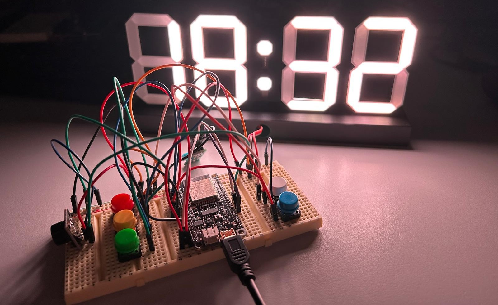
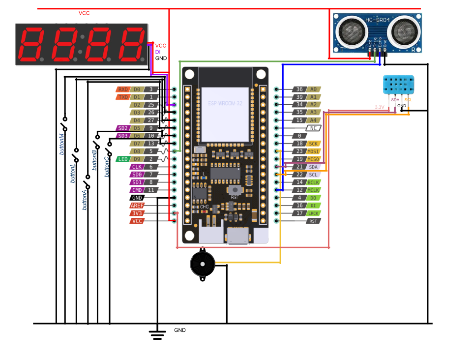
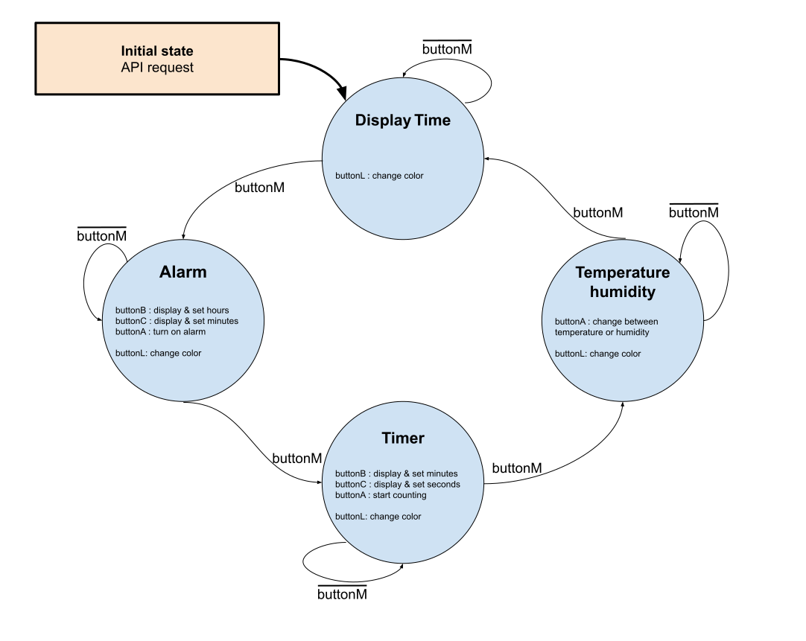
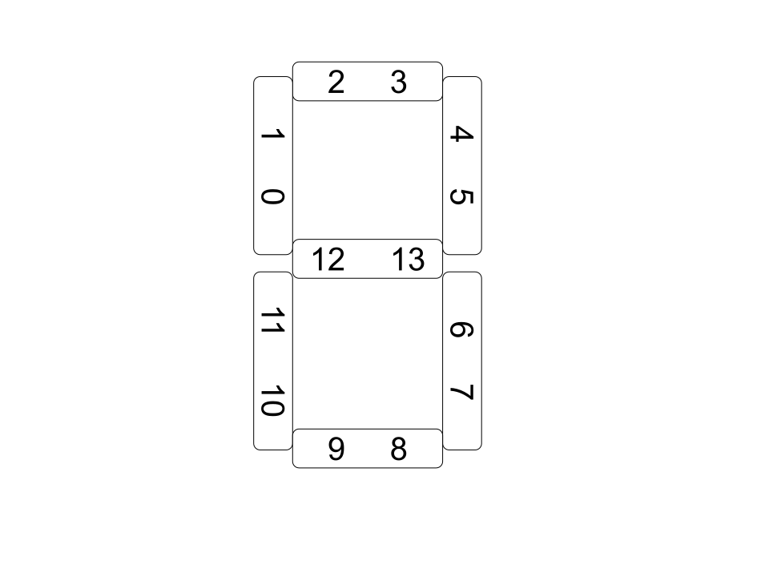
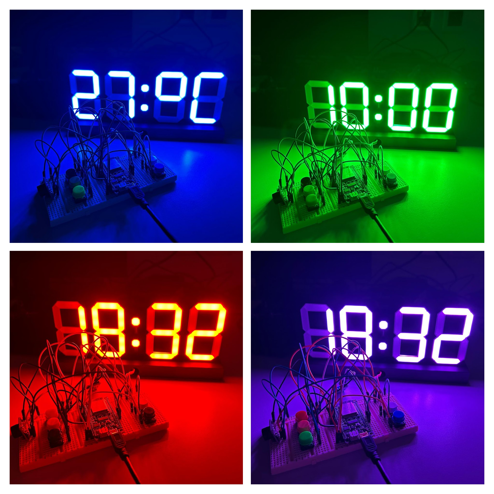

# Project BPA DE2 : Clock

*Picture of the clock showing current time.*

## Team Members

* BERMAN Noam (responsible for code)
* BRON Matthieu (responsible for github)
* CLOUARD Adam (responsible for documentation)

## Implementations

* [Showing current time](#display-current-time)
* [Alarm Clock](#alarm-clock)
* [Timer](#timer)
* [Temperature & Humidity](#temperature-and-humidity)
* Change time zone
* Change time color
* Light intensity base on distance

## Hardware description
For our project, we used :
* 1 ESP32 board with pre-installed MicroPython firmware
* 1 USB cable
* 1 Breadboard
* 5 Push buttons
* 4 NeoPixel displays
* 1 Proximity sensor
* 1 Temperature and humidity sensor (DHT12)
* 1 Buzzer
* Jumper wires

<b>Wiring of Digital clock</b>

## Software description

### State machine

*Digital clock diagram*

To reduce the number of buttons, we decide to create a state machine. We defined 4 different states. The first one is used to <b>display the current time</b>. The second one is used to set an <b>alarm</b>. The third one is used to set a <b>timer</b> and the last one is used to <b>display ambiant temperature and humidity</b>.
In the code, we use a global variable called <b>mode</b> which takes values between 0 and 3 and it is modified thanks to the function [`statemode()`](samplesOfCode/statemode.md).\
Depending on this variable
* We display informations on the current state with the function [`state()`](samplesOfCode/state.md).
* Buttons A, B and C get different purpose with the function [`configure_buttons()`](samplesOfCode/configure_buttons.md).

### Display current time
First we connect to wifi thanks to the method [`connect_wifi()`](samplesOfCode/connect_wifi.md). Then, we did an API request with [`get_time()`](samplesOfCode/get_time.md) to get current local time and save the result into variables.\
To display numbers on NeoPixels, we created a <b>dictionary</b>, connecting numbers and location of display's leds.\
\
*Schematic of one NeoPixel display used to set the dictionarry*\
 
We created the function [`display_time()`](samplesOfCode/display_time.md) who takes hour, minutes and the color we would like to display.\
To keep time accurate, each second, we call [`update_time()`](samplesOfCode/update_time.md).

### Alarm clock
We enter to "Alarm" mode, and to set the alarm, we created global variables: <b>alarm_h</b> and <b>alarm_m</b> which store value of the alarm time. We set this two variables thanks to buttonB and buttonC. There is also <b>alarm_on</b>, a boolean which allows to enable or disable alarm. Each seconds, we call the function [`Alarm()`](samplesOfCode/Alarm.md) which check if current time is equals to alarm time and if the alarm is enable. If it's the case, the alarm starts to ring.

### Timer
We enter to "Timer" mode and like the alarm, to set <b>minute_timer</b> and <b>second_timer</b> which are timer's variables, we click on buttonB and buttonC.
Then, to start the timer, we click on buttonA. This action will call [`toggle_timer()`](samplesOfCode/toggle_timer.md) and [`timer()`](samplesOfCode/timer.md). We can pause the timer by clicking again on buttonA.

### Temperature and humidity
In order to display temperature and humidity, we used a variable <b>display_mode</b> that control in which mode we are. When this variable is 0, the captor return the current temperature and we display it on the digital clock with the function [`display_change()`](samplesOfCode/) including the symbols °C. The same process happens for humidity when <b>display_mode</b> is equal to 1. You can switch between the 2 modes as you wish.

### Modules used for this project
In our project, we use several modules. Firstly, to get current time with an API request, we used `network` to connect the ESP32 to wifi, `urequests` to do the request and  `json` to access important values of the request. From the module `machine`, we import <b>Timer</b> to get current time accurate, <b>Pin</b> to use ESP32's GPIO, <b>I2C</b> to use temperature and humidity sensor and <b>PWM</b> to control the buzzer. We also use `time` module, particularly to use <b>sleep()</b> function. The module `neopixel` was used to switch on NeoPixels displays, change their color and so on. Finally, the module `_thread` was used to pause the timer.

## Instructions and photos

Here is a table summing up use of buttons depending on the current state.

| Button / Mode                 |   M (yellow)  |   L (white) |   A (red)                 |   B (green)       |   C (blue)           |
| :----:                        | :----:        | :----:      | :----:                    | :----:            | :----:               | 
| Display current time           | Mode          | Light       |Stop alarm                 | Change time zone  | -                    |
| Set Alarm                     | Mode          | Light       |Switch On/Off alarm        | Increase hours    | Increase minutes     |
| Set Timer                     | Mode          | Light       |Start Timer                | Increase minutes  | Increase seconds     |
| Display Trmperature & humidity| Mode          | Light       |Change temperature/humidity| -                 |      -               |  

## References and tools

* API current time request [timeapi.io](https://timeapi.io/api/time/current/zone?timeZone=Europe/Prague)
* Use a dictionary in Python [w3schools.com](https://www.w3schools.com/python/python_dictionaries_access.asp) and convert string into a dictionary [geeksforgeeks.org](https://www.geeksforgeeks.org/python-convert-string-dictionary-to-dictionary/)
* Access one specific char of a string [computerscienced.co](https://computerscienced.co.uk/site/knowledge-base/how-do-i-get-the-first-letter-of-a-string-in-python/)
* To know RGB color codes [rapidtables.com](https://www.rapidtables.com/web/color/RGB_Color.html)
* Functions linked to pin class [micropython.org](https://docs.micropython.org/en/latest/library/machine.Pin.html)
* Understand Neopixel Class [micropython.org](https://docs.micropython.org/en/latest/library/neopixel.html)
* ESP32 online simulation [wokwi.com](https://wokwi.com)
* Understand interupts in micropython [gammon.com](https://www.gammon.com.au/interrupts)
* Distance captor [randomnerdtutorials.com](https://randomnerdtutorials.com/micropython-hc-sr04-ultrasonic-esp32-esp8266/)
* Temperature and Humidity sensor [github.com](https://github.com/tomas-fryza/esp-micropython/tree/main/lab6-serial)
* We also use AI to debug code when we can't access to the ESP32 [chatgpt.com](https://chatgpt.com)