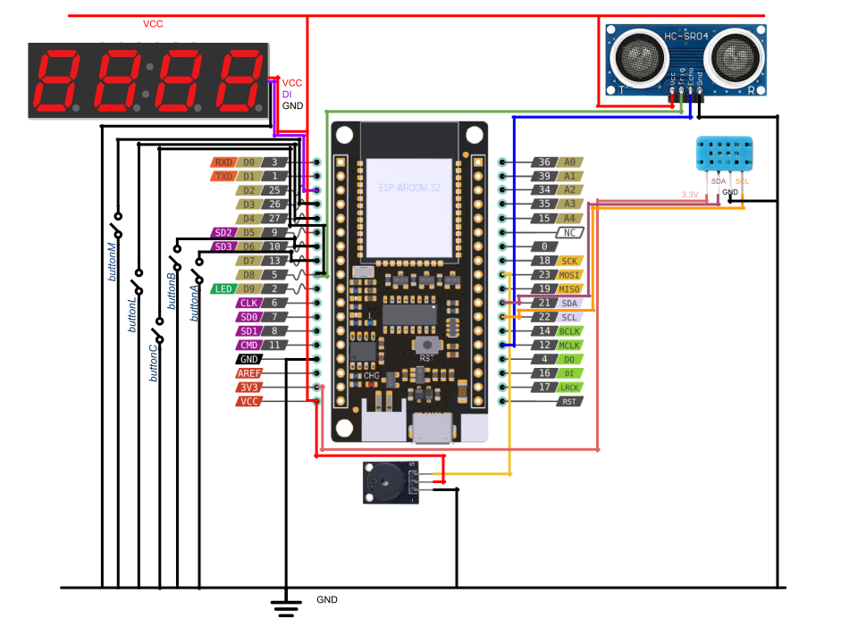

# Project BPA DE2 : Clock

* [Part 1: Showing current time](#CurentTime)
* [Part 2: Alarm Clock](#AlarmClock)

## Team Members

* BERMAN Noam (responsible for code)
* BRON Matthieu (responsible for github)
* CLOUARD Adam (responsible for documentation)

## Implementations

* Showing current time
* Alarm clock
* Light mode base on distance
* Change Time color
* Temperature and humidity sensor
* Time zones
* <em>Automatic night mode base on time</em>
* <em>Timer</em>

## Hardware description
For our ptoject, we used :
* ESP32 board with pre-installed MicroPython firmware, USB cable
* Breadboard
* 5 Push button
* 4 NeoPixel displays
* Proximity sensor
* Temperature and humidity sensor
* Jumper wires

Wiring of digital clock



## Software description
<u>Include flowcharts of your algorithm(s) and direct links to the source files.Present the modules you used in the project</u>

State machine of digital clock


<u>Mettre les fonctions python de machine à état</u>


<a name="CurentTime"></a>

### Display current time
First we connect to wifi thanks to the method [`connect_wifi()`](samplesOfCode/connect_wifi.md) . the, we did an API request with the [`get_time()`](samplesOfCode/get_time.md) to get current local time.\
To display numbers on NeoPixels, we created a <b>dictionarry</b>, connecting nunmbers and location of display's leds.\
\
*Schematic of one NeoPixel display used to set the dictionarry*\
<br>
We created the function [`display_time()`](samplesOfCode/display_time.md) who takes hour, minutes and the color we d'like to display.\
To keep time accurate, we call [`update_time()`](samplesOfCode/update_time.md).


<a name="AlarmClock"></a>

### Alarm clock
To have an alarm, we created global varaibles in our program : <b>alarm_h</b> and <b>alarm_m</b> which store value of the alarm time and <b>alarm_on</b>, a boolean which permit to enable or disable alarm.\
Each seconds, we call the function [`Alarm()`](samplesOfCode/Alarm.md) which check if current time is equals to alarm time. If it's the case, the alarm starts to ring.


<a name="Timer"></a>

### Timer

<a name="Temperature_humidity"></a>

### Temperature and humidity


## Instructions and photos


Here is a table summing up use of buttons depending on the current state.\

| Button / Mode                 |   M (yellow)  |   L (white) |   A (red)                 |   B (green)       |   C (blue)           |
| :----:                        | :----:        | :----:      | :----:                    | :----:            | :----:               | 
| Display curent time           | Mode          | Light       |Stop alarm                 | Change time zone  | -                    |
| Set Alarm                     | Mode          | Light       |Switch On/Off alarm        | Increase hours    | Increase minutes     |
| Set Timer                     | Mode          | Light       |Start Timer                | Increase minutes  | Increase seconds     |
| Display Trmperature & humidity| Mode          | Light       |Change temperature/humidity| -                 |      -               |  


States are defined thanks to the function `state()`.
```Python
def state():
    #Display curent Time
    if (statemode() == 0):
        print("mode 0")
        #Display Time
        display_time(hour,minute,color_index)
        if (AlarmOn == True):
            alarm(hour,minute)
        #change time zone
        buttonB.irq(trigger = Pin.IRQ_FALLING, handler = lambda pin: handle_debounced(pin, convert_timezone))
        # Switch on / off alarm
        

    #Set and display alarm time
    elif (statemode() == 1): # Alarm
        print("mode 1")
        display_time(alarmH, alarmM, color_index)
        buttonB.irq(trigger = Pin.IRQ_FALLING, handler=lambda pin: handle_debounced(pin,increment_AlarmH))
        buttonC.irq(trigger = Pin.IRQ_FALLING, handler=lambda pin: handle_debounced(pin,increment_AlarmM))
        buttonA.irq(trigger = Pin.IRQ_FALLING, handler=lambda pin: handle_debounced(pin,alarm_on_off))

    # Set and display timer
    elif (statemode() == 2):
        print("mode 2")
        display_time(minute_timer, second_timer, color_index)
        buttonC.irq(trigger = Pin.IRQ_FALLING, handler=lambda pin: handle_debounced(pin,increment_second))
        buttonB.irq(trigger = Pin.IRQ_FALLING, handler=lambda pin: handle_debounced(pin,increment_minute))
        #/!\ pas sûr pour de l'appel de fonction
        buttonA.irq(trigger = Pin.IRQ_FALLING, handler=lambda pin: handle_debounced(pin,toggle_timer))

    elif (statemode() == 3):
        print("mode 3")
        buttonA.irq(trigger = Pin.IRQ_FALLING, handler=lambda pin: handle_debounced(pin,display_change))
```


## References and tools

* API current time request [timeapi.io](https://timeapi.io/api/time/current/zone?timeZone=Europe/Prague)
* Use a dictionarry in Python [w3schools.com](https://www.w3schools.com/python/python_dictionaries_access.asp) and convert string into a dictionarry [geeksforgeeks.org](https://www.geeksforgeeks.org/python-convert-string-dictionary-to-dictionary/)
* Acces one specific char of a strig [computerscienced.co](https://computerscienced.co.uk/site/knowledge-base/how-do-i-get-the-first-letter-of-a-string-in-python/)
* To know RGB color codes [rapidtables.com](https://www.rapidtables.com/web/color/RGB_Color.html)
* Functions linked to pin class [micropython.org](https://docs.micropython.org/en/latest/library/machine.Pin.html)
* ESP32 online simulation [wokwi.com](https://wokwi.com)